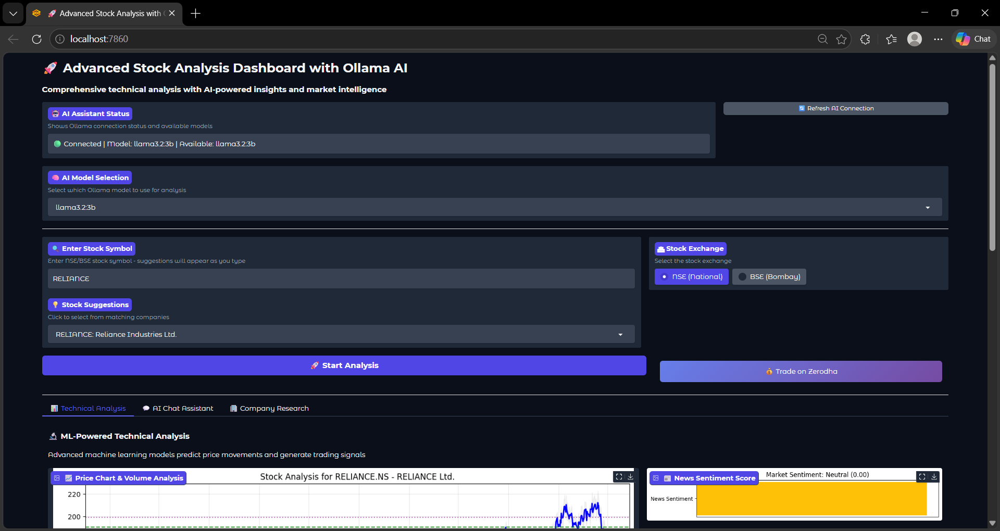
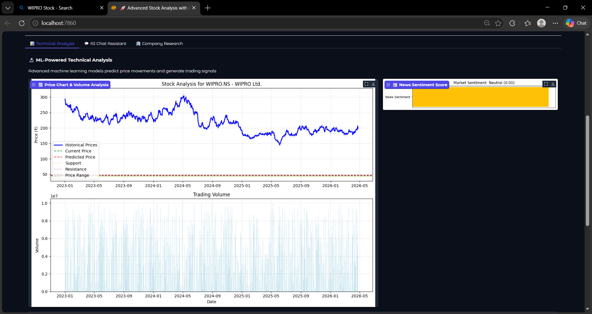

# AI Stock Analysis Dashboard

An intelligent financial analysis platform that combines traditional technical indicators with Machine Learning predictions and LLM-powered insights. This project is designed to provide a comprehensive look at Indian stock market data with an easy-to-use Gradio interface.

## 📊 Project Visuals

### Dashboard Overview


### Technical Analysis & Volume


## Features
- **Machine Learning**: Utilizes **Random Forest** models to forecast next-day price movements and trading directions.
- **AI Chat Assistant**: Integrated with **Ollama (Llama 3.2)** for real-time expert analysis and interactive queries.
- **Technical Indicators**: Automatically calculates RSI, MACD, Bollinger Bands, and Moving Averages.
- **Sentiment Analysis**: Scrapes and analyzes recent news to determine market sentiment (Positive/Negative/Neutral).
- **Interactive UI**: Built with Gradio for a seamless, production-ready dashboard experience.

## Getting Started

### Prerequisites
1. **Python 3.8+**
2. **Ollama**: Download and install from [ollama.com](https://ollama.com/).
   - Start the service: `ollama serve`
   - Download the model: `ollama pull llama3.2`

### Installation
1. Clone the repository:
   ```bash
   git clone [https://github.com/harinand-p/AI-stock-analysis-dashboard.git](https://github.com/harinand-p/AI-stock-  analysis-dashboard.git)
   
   cd AI-stock-analysis-dashboard
2. Install dependencies:
   ```bash
   pip install -r requirements.txt
3. Run the application:
  ```bash
   python main.py
